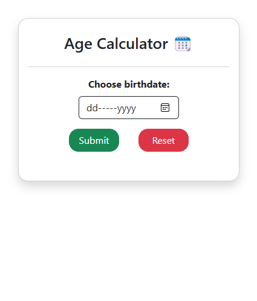
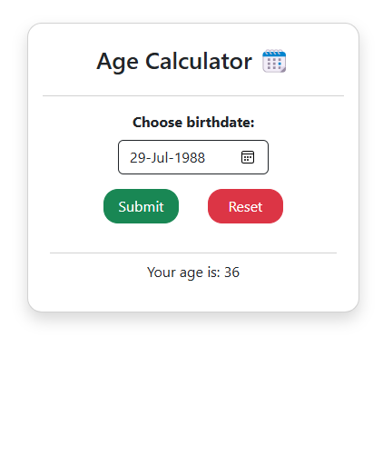

# Age Calculator in React JS

## Overview

This project is part of the Codevixens Frontend Development Challenge (Day 1). The goal is to build a simple yet functional age calculator using React JS, focusing on mastering state management and event handling.

## Features

- **State Management**: Utilizes React's `useState` hook to manage the input value and calculated age.
- **Event Handling**: Handles user input and button click events to calculate the age.
- **Responsive UI**: Simple and user-friendly interface for entering birthdate and displaying the calculated age.

## Installation

1. Clone the repository:

```bash
git clone https://github.com/gideonagyage/age-calculator.git
```

2. Navigate to the project directory:

```bash
cd age-calculator
```

3. Install dependencies:

```bash
npm install
```

## Usage

1. Start the development server:

```bash
npm start
```

2. Open your browser and navigate to

```bash
http://localhost:3000.
```

## How It Works

1. Input Field: Enter your birthdate.
2. Submit Button: Click to calculate your age.
3. Age Display: The calculated age is displayed below the form.

## Screenshots of the Age Calculator UI

- Before Entering Birthdate

<br>



- After Entering Birthdate

<br>



## Live Demo

Check out the live demo [here](https://age-calculator-pi-green-34.vercel.app/).

## Reflection

Building this age calculator helped me enhance my understanding of React components, state management, and event handling. It was a great learning experience!

## Contributing

Feel free to fork this repository and submit pull requests. Any contributions are welcome!

## License

This project is licensed under the MIT License.

## Acknowledgements

- Codevixens for organizing the challenge.
- Chinaza Igboanugo, Lois Bassey, and Oyinkansola Shoroye for their contributions and guidance.

Feel free to customize it further to fit your needs! If you have any specific details you'd like to add or change, let me know.
